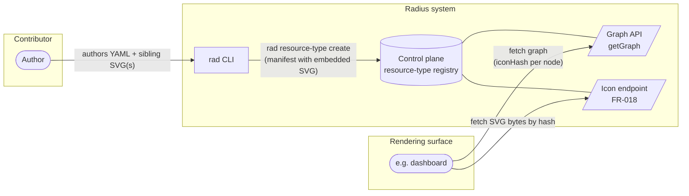
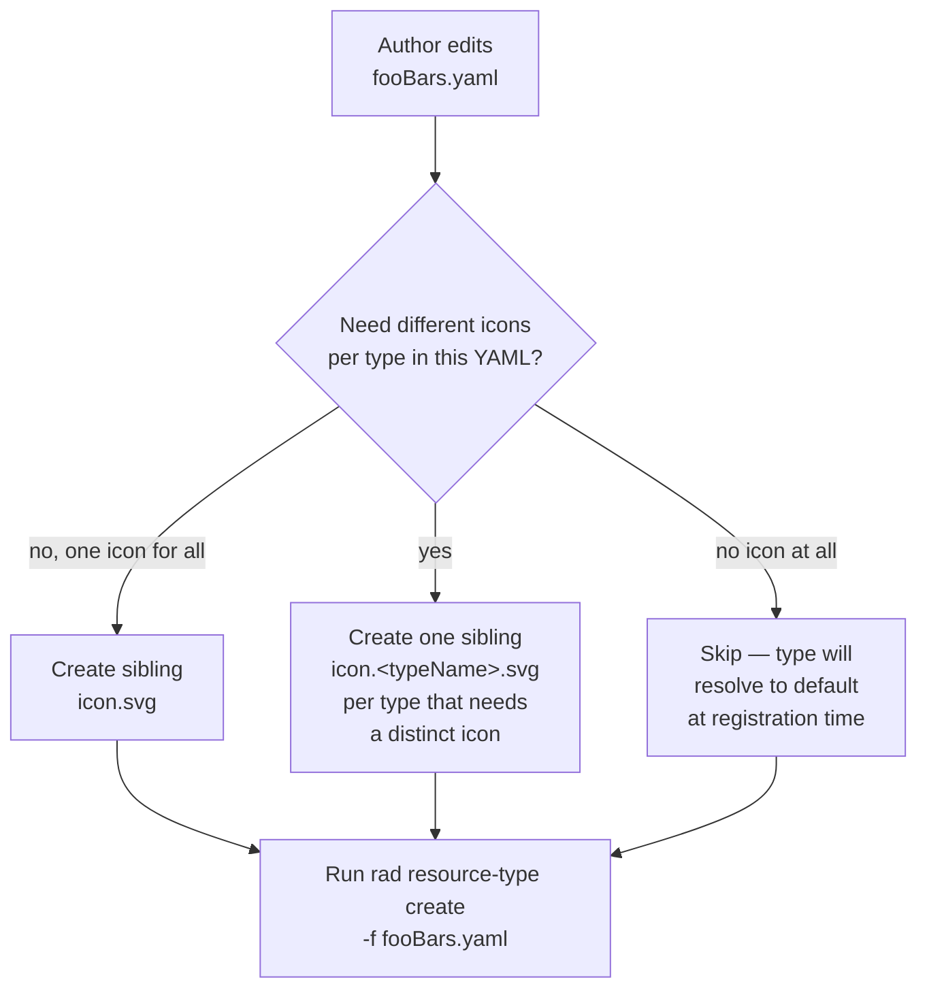
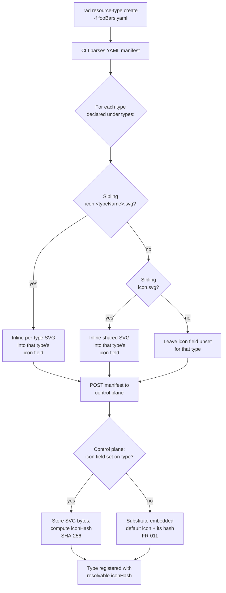
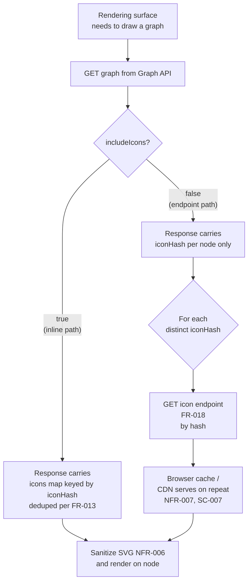

# Feature Specification: Resource Type Icons

## Purpose

Resource type authors can add an optional SVG icon to every Radius resource type so resource types in visual application graph renderings are visually distinct. Authors create icons as ordinary SVG files alongside their resource type definitions. Resource type registration embeds each icon's SVG text directly into the resource type manifest that registers the type with the control plane. The same registration path is used for contributed types (registered via `rad resource-type create`) and built-in types (loaded from `deploy/manifest/built-in-providers/`) — so the icon travels with the type, not as a separate artifact. When a rendering surface needs to display an icon, icons are addressed by content hash and delivered either inline with the graph or via a cacheable HTTP endpoint. Every resource type — contributed, built-in, or `Applications.Core/*` — flows through the same contract, with a default icon as fallback.

## System context

The icon feature spans three actors: the **contributor** who authors a resource type, the **`rad` CLI + control plane** that register the type, and the **rendering surface** (dashboard or any future first-party graph view) that displays it. The diagrams below show each in isolation.

## Authoring flow

The author can specify an icon for all resource types in a given YAML definition, or specify a different icon for each type.

The YAML definition for resource type authoring is not affected by the icon feature.

## Registration flow

What `rad resource-type create` and the control plane do when the author runs the publish command.

## Rendering flow

How a rendering surface like the dashboard (or any future graph view) resolves icons for display. Two equivalent paths are supported: (1) inlining the icon bytes directly into the graph response, and (2) fetching the icon bytes from a content-addressed endpoint.

Renderer-side behavior on a 404, network failure, or malformed bytes (e.g. drawing a fallback glyph) is the rendering surface's concern and is out of scope for this spec — see [Out of Scope](#out-of-scope).

Non-rendering consumers (`rad app graph -o json`, scripting clients) take the endpoint path by default — they receive `iconHash` only.

## User Scenarios *(mandatory)*

### Story 1 — Default icon for every resource type (P1)

A developer views an application graph. Every node displays a meaningful icon — even when the type's author provided none — because the build always falls back to the repository-wide default icon.

**Why P1**: Without a guaranteed default, every consumer must invent its own default icon.

**Test**: Register a type that declares no icon, deploy an app using it, run an icon check using the default icon's hash.

### Story 2 — Authoring a custom icon (P1)

A contributor creates a sibling `icon.svg` file next to a resource type definition and runs the existing publish command. The icon flows through publish → control plane → graph → dashboard with no hand-editing of the definition file.

**Why P1**: Authors will not adopt a contract that requires hand-editing embedded XML in YAML.

**Test**: Add `icon.svg` to a type folder, publish, run an icon check using the new icon's hash.

### Story 3 — Built-in types ship with custom icons (P2)

On a fresh install, every `Applications.Core/*` type listed in FR-008 (`environments`, `applications`, `containers`, `gateways`, `secretStores`, `extenders`) renders with its own distinct icon — not the default, not the same as each other. These types drive a new user's first-run experience.

**Why P2**: New users see built-ins before contributed types. The first graph they render must be meaningful.

**Test**: Fresh install, deploy a sample app exercising each `Applications.Core/*` type, run an icon check on each node and confirm no node resolves to the default-icon hash.

### Story 4 — Contributor guidance and CI safety net (P2)

A pull request that adds a malformed, oversized, or non-SVG icon is rejected by CI with an actionable error. A pull request in the Radius product repository that removes or breaks the embedded product default icon is also rejected. Documentation tells contributors exactly where to put the file.

**Why P2**: Without CI enforcement, the icon contract decays over time.

**Test**: Open PRs that violate each rule and confirm CI rejects them; confirm the contributing guide documents file location, format, and size cap.

### Edge Cases

- Unsupported format (PNG/JPEG/GIF) in a type folder → build fails with an actionable error pointing to SVG.
- Empty or unparseable SVG → build fails before publishing.
- YAML declares multiple types under `types:` → each type is resolved independently per FR-002a (per-type file → shared `icon.svg` → default at runtime).
- Sibling `icon.<typeName>.svg` whose `<typeName>` does not match any type in the YAML → build fails with an actionable error (FR-002b).
- Both `icon.<typeName>.svg` and `icon.svg` present → the per-type file wins for that one type; other types in the YAML still use `icon.svg`.
- Default icon missing or invalid at Radius product build time → product build fails loudly.
- Icon endpoint receives a stale hash (e.g. cached dashboard after a re-publish) → returns 404. Renderer-side handling of the 404 is out of scope for this spec.

## Requirements *(mandatory)*

### Authoring (contributing repository)

- **FR-001**: A single canonical default icon lives in the Radius product repository (`radius-project/radius`) and is embedded into the CLI and control-plane binaries at build time. (The exact path is a planning concern.) The default is owned by the Radius product, not by `resource-types-contrib`, because its only runtime consumer is the control plane's substitution step (FR-011) for manifests that arrive without an `icon` field — primarily externally-registered types (A-003). Neither contributed types (which ship sibling SVGs or fall through to runtime substitution) nor built-in types (FR-008, never default) consume it at build time.
- **FR-002**: A resource type declares a custom icon by placing one of the following sibling files next to its definition YAML:
  - **Per-type file**: `icon.<typeName>.svg` (lowercase, exact match against a key under `types:` in the YAML). Used only for that one type. Required when the author wants different icons for different types declared in the same YAML.
  - **Shared file**: `icon.svg` (lowercase). Applies to every type declared in the YAML that does not have its own `icon.<typeName>.svg`.

  Per-type files always win over the shared `icon.svg` in the same folder. No other filename is recognized.
- **FR-002a**: Per-type resolution order, evaluated independently for every type declared under `types:` in the YAML:
  1. Sibling `icon.<typeName>.svg` next to the YAML — if present, use it.
  2. Sibling `icon.svg` next to the YAML — if present, use it.
  3. The product default icon embedded in the control-plane binary (FR-001) — applied during the control plane's runtime substitution (FR-011), not embedded by the publish step.

  A YAML that declares N types and ships no sibling SVGs is valid; all N types resolve to the default at registration time.
- **FR-002b**: A sibling file named `icon.<typeName>.svg` whose `<typeName>` does not match any key under `types:` in the adjacent YAML is a build-time error (FR-005). This prevents typos silently degrading to the default.
- **FR-003**: Contributors never edit the resource type definition file to attach an icon — they only manage the sibling SVG file(s). The source YAML on disk is unchanged by this feature; icon embedding happens in-flight during publish (FR-004), not by rewriting the file. See the [Authoring flow](#authoring-flow) section above for the end-to-end picture.

### Build and packaging

- **FR-004**: `rad resource-type create` resolves each type's icon at read time (sibling `icon.<typeName>.svg`, then sibling `icon.svg`, per FR-002a) and embeds the SVG text into the manifest payload before POSTing it to the control plane. The source YAML file is not modified on disk. The manifest the control plane stores is self-contained. `rad bicep publish-extension` is **out of scope** for icon embedding: Bicep extensions are consumed by authoring tools (the Bicep compiler and IDE extension) that do not render icons, and embedding icons there would create a second authoritative copy that can drift from the one registered with the control plane. If a future Bicep-adjacent authoring surface needs icons, it must fetch them via FR-018 by `iconHash` rather than re-embedding.
- **FR-005**: The publish command fails with an actionable error if the resolved icon is missing, not SVG, malformed, or exceeds the size cap (NFR-002).
- **FR-005a**: The control plane validates SVG bytes at registration time and **rejects** (does not rewrite) any manifest whose `icon` field:
  - is not well-formed XML,
  - has a root element other than `<svg>`,
  - contains `<script>` elements or any `on*` event-handler attributes,
  - contains `<foreignObject>`,
  - references external resources via `href` / `xlink:href` to anything other than a `data:` URL, or
  - exceeds the size cap (NFR-002).

  Accepted bytes are stored **verbatim** so `iconHash` (FR-010) remains a stable SHA-256 of exactly what the author published. This validation is a fail-fast guard at the registry boundary; it does **not** replace renderer-side sanitization (NFR-006), which remains the trust boundary for DOM injection.
- **FR-006**: The Radius product build embeds the in-tree default icon (FR-001) into the CLI and control-plane binaries (e.g. via `go:embed`) and fails if it is missing or invalid. No cross-repository vendoring step is required.
- **FR-007**: The built-in provider manifests under `deploy/manifest/built-in-providers/{dev,self-hosted}/` are regenerated through the same flow so every built-in type's manifest carries its icon embedded.

### Built-in types

- **FR-008**: Every `Applications.Core/*` type — at minimum `environments`, `applications`, `containers`, `gateways`, `secretStores`, `extenders` — ships with its own custom SVG **embedded at build time** into the built-in manifest via the FR-007 regenerated-manifest flow. They are on the embed-at-build path, not the runtime default-substitution path (FR-011); none of them fall back to the repository-wide default.
- **FR-009**: Icons for built-in types follow a sibling-file convention analogous to FR-002 (single SVG colocated with the manifest source; no YAML hand-edits). Exact directory layout is a planning concern.

### Wire contract

> **Implementation note — one struct, two serializations.** The CLI uses a single Go struct (today: `manifest.ResourceType` in `pkg/cli/manifest/manifest.go`) to represent a resource type, and that struct is serialized in two directions: **inbound from authored YAML** (when the CLI reads a `-f <file>.yaml` argument) and **outbound as JSON over HTTP** (when the CLI POSTs to the control plane via the generated `v20231001preview.ResourceTypeProperties` wire model). The `icon` field added by this feature is **present on the struct** (so the resolver can populate it and the wire layer can forward it) but **deliberately excluded from the YAML surface** so authors cannot set it from the source file. Concretely: the struct field carries a `json:"icon,omitempty"` tag and a `yaml:"-"` tag, and the YAML decoder runs in strict / known-fields mode so an `icon:` key in the source YAML is a hard error rather than a silent override. This is the mechanism that makes FR-003 ("authors never edit the definition file to attach an icon") enforceable rather than aspirational.
>
> **Implementation note — which files are hand-written vs. generated.** Two Go structs are involved, with different change paths:
>
> 1. **CLI YAML model — hand-written.** `manifest.ResourceType` in `pkg/cli/manifest/manifest.go` is plain Go (no codegen header). The new `Icon` field, its `json` / `yaml` tags, and the strict-decoder change (FR-010a) are normal source edits.
> 2. **HTTP wire model — generated from TypeSpec.** `v20231001preview.ResourceTypeProperties` lives in `pkg/ucp/api/v20231001preview/zz_generated_models.go` (the `zz_generated_` prefix is the convention for "do not edit"). It is regenerated from `typespec/UCP/resourceproviders.tsp`, where `model ResourceTypeProperties { ... }` is the source of truth. Adding `icon` to the wire model means editing the TypeSpec and re-running the generator; the `.go` file is never edited directly.
>
> `iconHash` is server-computed and read-only. In TypeSpec it should be tagged `@visibility(Lifecycle.Read)` so it appears on response models only — the CLI never writes it, so the `yaml:"-"` protection that `icon` needs does not apply.
>
> Net touch points for FR-010 / FR-010a:
>
> | Layer | File | Change |
> |---|---|---|
> | TypeSpec source | `typespec/UCP/resourceproviders.tsp` | Add `icon?: string` and `@visibility(Lifecycle.Read) iconHash?: string` to `ResourceTypeProperties`. |
> | Generated wire Go | `pkg/ucp/api/v20231001preview/zz_generated_*.go` | Regenerated automatically — do not hand-edit. |
> | Hand-written CLI Go | `pkg/cli/manifest/manifest.go` | Add `Icon *string` with `json:"icon,omitempty"` and `yaml:"-"`; switch the YAML decoder to known-fields / strict mode. |
> | Hand-written wire mapping | `pkg/cli/manifest/registermanifest.go` | Add `Icon: resourceType.Icon` to the `ResourceTypeProperties{...}` literal in the per-type loop. |

- **FR-010**: A single optional `icon` field (SVG content as text) and a derived `iconHash` (SHA-256 of the canonical text) are added to the resource type model used by the CLI and exposed on the JSON wire schema that `rad resource-type create` POSTs to the control plane (and that the control plane stores and returns). The field is **not** part of the authored YAML surface: the CLI's YAML decoder rejects an `icon` key in the source file (see FR-010a), and round-tripping a YAML file through the CLI never produces an `icon:` line on disk. The CLI populates the field in memory from the sibling SVG resolution in FR-004 before the wire request is built. Manifests that arrive at the control plane without an `icon` field continue to validate and register unchanged — the control plane substitutes the default per FR-011.
- **FR-010a**: The CLI's manifest YAML decoder operates in strict mode for the `icon` key specifically (and ideally for all unknown top-level keys under each `types.<typeName>` entry). A source YAML that contains `icon:` at any type level fails to parse with an actionable error directing the author to the sibling-file convention (FR-002). This enforces FR-003 by construction — the only path for an icon to reach the wire payload is the sibling-file resolver.
- **FR-011**: Every API surface that returns a resource type definition or an application graph carries `iconHash` for every type/node — regardless of the manifest's origin. Three origins converge on this contract:
  1. **Contributed types** published from `resource-types-contrib` YAML via the FR-004 flow — bytes embedded at build time.
  2. **Built-in types** (including `Applications.Core/*`) regenerated via FR-007 — bytes embedded at build time.
  3. **Externally-registered types** (A-003) — hand-edited or otherwise-produced manifests that arrive without an `icon` field; the control plane substitutes the embedded default icon's hash at registration time.

  No API surface ever returns a null or empty icon reference, and the wire contract does not distinguish among the three origins.
- **FR-012**: SVG bytes, wherever delivered (the `icon` field, an `icons` map, or the icon endpoint), are embedded verbatim as text. No base64, no URL indirection, no file paths.
- **FR-013**: A single response never duplicates bytes. When a response carries an `icons` map, it contains at most one entry per distinct `iconHash` regardless of how many references point at it.
- **FR-014**: All icon-related fields (`icon`, `iconHash`, `icons`) are additive on the in-use preview API versions. Clients that don't know about them continue to function (NFR-004).

### Opt-in inlining and dedicated endpoint

- **FR-015**: API surfaces that can return icon bytes accept an `includeIcons` query parameter. When `true`, the response embeds bytes (deduped per FR-013). When `false` or absent, the response carries hashes only. **Default is `false`** so non-rendering consumers (notably `rad app graph -o json`) don't pay for bytes they can't render.
- **FR-016**: The dashboard requests graphs with `includeIcons=true` *or* fetches bytes via the endpoint (FR-018) — either way, it renders the bytes addressed by each node's `iconHash`.
- **FR-017**: `rad app graph` defaults to `includeIcons=false`; JSON output carries `iconHash` per node, not bytes. An explicit flag (e.g. `--include-icons`) opts in.
- **FR-018**: The control plane exposes `GET /planes/radius/{plane}/providers/{namespace}/resourceTypes/{type}/icons/{hash}` returning bytes with `Content-Type: image/svg+xml`, `Cache-Control: public, max-age=31536000, immutable`, and a strong `ETag` derived from the hash. A hash that doesn't match the stored bytes returns 404. Auth matches the resource-type metadata endpoints.
- **FR-019**: Future graph-shaped endpoints (plan/preview/in-progress visualizations) reuse this same contract — `iconHash` per node, `includeIcons` for inline bytes, FR-018 for byte resolution. They do not invent a separate icon model.

### Rendering and validation

- **FR-021**: Contributing-repo CI validates that every sibling icon file is well-formed SVG within the size cap. Radius-repo CI validates the product default icon (FR-001) under the same rules.

### Non-Functional Requirements

- **NFR-001**: Icons are SVG. Other formats are rejected.
- **NFR-002**: Maximum size per icon is 32 KiB (32 768 bytes), enforced in both the build step (FR-005) and CI (FR-021).
- **NFR-003**: All icon-related schema fields are optional.
- **NFR-004**: The change is additive on the wire — older clients continue to operate normally.
- **NFR-006**: The dashboard sanitizes all SVG bytes before injecting them into the DOM (defense against script injection via malicious icons) and is otherwise defensive against malformed content so a bad icon cannot break the graph view. The renderer is the trust boundary for DOM-injection safety: the control plane rejects obviously-dangerous SVG at registration (FR-005a) but never rewrites bytes, so renderers must not assume stored icons are safe to inline — externally-registered manifests (A-003) and future non-first-party publishers can still reach the registry.
- **NFR-007**: The icon endpoint (FR-018) is servable from a precomputed map (bytes for a given hash are immutable) and is safe behind a CDN — no per-request recomputation.

### Key Entities

- **Resource Type Definition**: Contributor-authored type description (YAML on disk). The YAML surface is unchanged by this feature — authors cannot set an `icon` field there (FR-010a rejects it at parse time). The optional `icon` (SVG text) and derived `iconHash` (SHA-256) exist on the in-memory model and on the JSON wire schema only; the CLI populates them from sibling SVG files (FR-004) before sending the request. See the implementation note above FR-010 for the one-struct / two-serializations mechanism.
- **Sibling Icon File**: `icon.svg` next to a definition file in the contributing repository. Source of truth, consumed only by the build step.
- **Default Icon**: A canonical SVG owned by the Radius product repository and embedded into the CLI and control-plane binaries at build time (FR-001, FR-006). The control plane substitutes it whenever a manifest arrives without an `icon` field. Has a well-known hash used whenever a type has no icon attached.

## Success Criteria *(mandatory)*

- **SC-001**: 100% of resource types registered with a freshly built control plane have a resolvable icon (custom or default), with no operator intervention.
- **SC-002**: 100% of nodes in any application-graph response carry a resolvable `iconHash`. With `includeIcons=true`, the `icons` map contains exactly one entry per distinct hash referenced (zero duplicates), verifiable on a sample app with 50+ same-type nodes (N → 1 dedup).
- **SC-003**: Every `Applications.Core/*` type listed in FR-008 renders with its own distinct icon (not the default, not the same as each other) in the dashboard on a fresh install.
- **SC-004**: A contributor adds a custom icon by dropping one SVG file and running the existing publish command — under 5 minutes end-to-end once the SVG is in hand.
- **SC-005**: A PR introducing a malformed, oversized, or non-SVG icon is rejected by CI with a single actionable error.
- **SC-006**: An existing client of any in-use preview API continues to function unchanged after the icon fields are added (verified by replay).
- **SC-007**: The dashboard fetches each unique icon's bytes from FR-018 at most once per browser session (verified via network trace; 304 / cache-hit on subsequent loads).

## Out of Scope

- Animated icons or raster formats (PNG, JPEG, WebP). SVG only.
- Theming, dark-mode variants, per-locale variants. One icon per type in v1.
- Per-instance icon overrides on deployed resources. Icon is a property of the type.
- Populating custom icons across the long tail of contributed resource types. This feature ships the mechanism, the default, and custom icons for built-ins; per-type artwork for contributed types is a follow-up.
- Native icon rendering in the CLI's human-readable text output. JSON output carries the hash for machine consumers; ASCII rendering is a separate concern.
- Dashboard (or any other rendering surface) implementation behavior, including how a renderer reacts to a 404, network failure, or malformed bytes from FR-018. The control plane's own fallback for manifests that arrive without an `icon` field is covered by FR-011; renderer-side fallback glyphs and error handling are the renderer's concern. NFR-006 still applies to any first-party Radius rendering surface.

## Background

- Radius resource types come from two sources: contributor-authored types in `resource-types-contrib`, and built-in types in `deploy/manifest/built-in-providers/{dev,self-hosted}/`. In both cases the artifact that reaches the control plane is a resource type manifest. For contributed types the author's YAML *is* the manifest source — `make build-resource-type` calls `rad resource-type create -f <yaml>` (register) and `rad bicep publish-extension -f <yaml>` (publish IDE/authoring extension) directly against the source file; there is no separate intermediate built-manifest file. Built-in types ship their manifests in the Radius product and load them at control-plane startup. The `Applications.Core/*` namespace ships via the built-in manifest flow alongside the other built-in providers.
- The CLI parses the YAML into an in-memory model and serializes that same model as JSON when it calls the control plane. Today the authored YAML and the JSON wire body are near-identical because every field on the model is present in both serializations. This feature is the first asymmetry: the `icon` field lives only on the JSON wire side (FR-010, FR-010a). Icon embedding happens inside the publishing `rad` CLI commands at read time — they populate the in-memory model from the sibling `icon.svg` and let the existing serialization step carry it into the JSON payload. No new pipeline; no on-disk rewrite of the author's YAML.
- UCP hosts the resource-type registry. Types reach the control plane via `rad resource-type create` against a manifest, or via the built-in manifests loaded at startup.
- The application graph is computed by the Core RP via a single `getGraph` operation. `rad app graph` and the dashboard both consume it, so adding `iconHash` to that one response covers both surfaces.
- TypeSpec is the source of truth for the affected API models; Go datamodels and wire types are generated from it.

## Assumptions

If any of these turn out false during planning, revisit the spec.

- **A-001**: The currently in-use preview API versions are the targets for the additive `icon` fields. No new API version is introduced.
- **A-002**: Auth/authz for the resource-type and graph endpoints is unchanged; icons inherit existing controls.
- **A-003**: Some types — **externally-registered types** — reach the control plane via paths that bypass the build-time icon-resolution step (e.g. hand-edited manifests via `rad resource-type create`). The runtime default-substitution behavior in FR-011 covers this origin.
- **A-004**: Icons are static and global per type — no per-environment, per-tenant, per-instance, per-theme, or per-locale variants in v1.
- **A-005**: A typical graph has tens of nodes; hundreds of same-type nodes are realistic. With the 32 KiB cap and per-response dedup (FR-013), response size scales with *distinct* icons (typically a handful), not node count — no pagination needed.
- **A-006**: The dashboard is the only first-party rendering surface for icons in v1. Other Radius surfaces (`rad app graph` text and `-o json`) do not render icons and do not need bytes by default.

## Design Alternatives Considered

**Chosen contract**: hash-keyed references everywhere; bytes delivered either inline (opt-in via `includeIcons`, deduped per response) or via a cacheable content-addressed endpoint. Backward compatible (older clients ignore the fields).

| Alternative | Why rejected |
|---|---|
| **Pure inline** — embed bytes on every node and every type description, always | Duplicates bytes for repeated types; forces CLI / scripting consumers to receive bytes they cannot render; provides no HTTP caching even for the dashboard |
| **Pure endpoint** — responses carry only a URL/ID; bytes always require a follow-up fetch | N+1 round trips for any renderer; eliminates the self-contained option; forces every consumer to handle partial-failure for a cosmetic feature |

**What would change the decision**:

- Inline payloads dominate graph response size in practice → flip `includeIcons` default for the dashboard too; rely solely on FR-018 + HTTP caching.
- Per-instance/theme/locale variants enter scope → extend `iconHash` with a variant selector, or move bytes behind FR-018 with query parameters.
- Icon auth needs to diverge from metadata auth (e.g. icons publicly fetchable, metadata gated) → split FR-018 onto a separate plane or origin.
- A second first-party rendering surface ships (docs site, IDE extension) → the endpoint contract is already right; only the dashboard's choice of mechanism updates.
