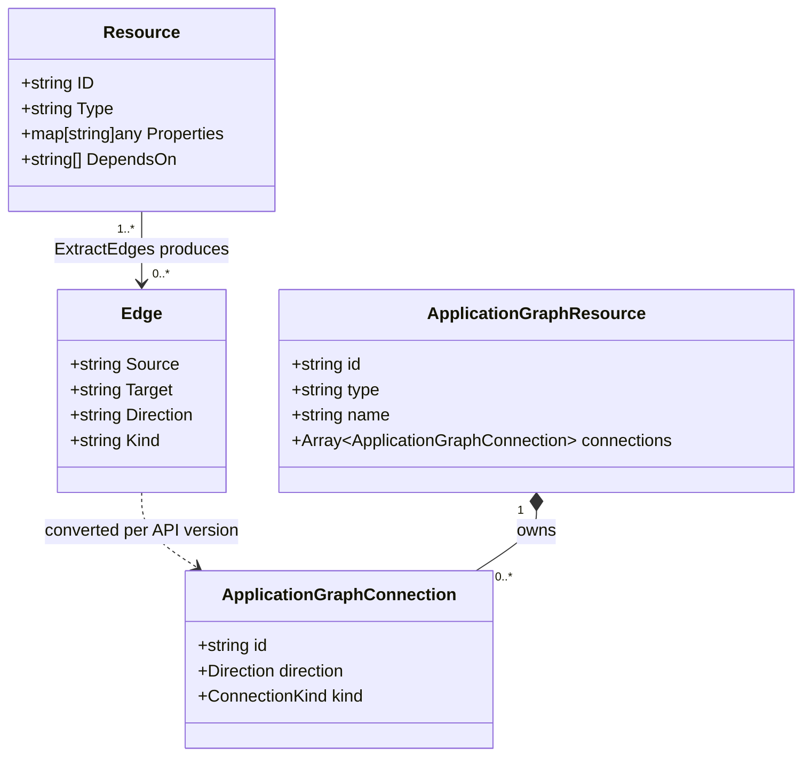

# Phase 1 Data Model — Application Graph Dependency Edges

**Feature**: [spec.md](spec.md) · **Plan**: [plan.md](plan.md) · **Date**: 2026-07-16

Two data models are introduced or modified in Phase 1.

- The **internal Go types** exposed by the new `pkg/graph/edges/` package — pure Go, no ARM syntax, no HTTP.
- The **wire type** on `Radius.Core/2025-08-01-preview` — one new enum, one new field. See [contracts/wire-change.md](contracts/wire-change.md) for the TypeSpec diff itself.

## `pkg/graph/edges/` — Go types

### `Resource` (input)

```go
// Resource is a graph-eligible Radius resource as seen by the edge
// extractor. Callers convert their own representation (ARM JSON entry,
// stored resource record, etc.) into this shape before calling
// ExtractEdges.
type Resource struct {
    // ID is the canonical Radius resource ID
    // ("/planes/radius/local/resourcegroups/…/providers/{ns}/{type}/{name}").
    ID string

    // Type is the Radius resource type ("Radius.Compute/containers").
    Type string

    // Properties is the resource's authored properties. The extractor
    // inspects properties["connections"] for author-declared connections.
    // Other keys are ignored in Phase 1.
    Properties map[string]any

    // DependsOn is the list of already-resolved canonical Radius resource
    // IDs the resource declares as build-time dependencies. The static
    // caller populates this from resolveDependsOn. The runtime caller
    // passes nil in Phase 1.
    DependsOn []string
}
```

**Validation & invariants**:

- `ID` is required and MUST be a canonical Radius resource ID.
- `Type` is required.
- `Properties` may be nil.
- `DependsOn` entries MUST be canonical resource IDs (not `[resourceId(...)]` expressions, not symbolic names). ARM-form entries are rejected by the caller before invoking `ExtractEdges` — the extractor does not parse ARM syntax (FR-019).

### `Edge` (output)

```go
// Edge is a single directed edge in the application graph.
type Edge struct {
    // Source is the canonical resource ID of the edge's source node.
    Source string

    // Target is the canonical resource ID of the edge's target node.
    Target string

    // Direction is "Outbound" or "Inbound".
    Direction string

    // Kind is "Connection" (from properties.connections) or "Dependency"
    // (from dependsOn). Case-sensitive, matches the wire enum values on
    // Radius.Core/2025-08-01-preview.
    Kind string
}
```

**Invariants**:

- Every `Outbound` edge from `A → B` MUST be accompanied by an `Inbound` edge from `A → B` on `B` with the same `Kind` (mirroring, FR-010).
- No emitted `Edge` has `Source` or `Target` in the exclusion list (FR-002).
- For any `(Source, Target)` pair on the same source resource, at most one outbound `Edge` is emitted. When both a `Connection` and a `Dependency` would be emitted for the same pair, `Connection` wins (FR-011). The corresponding mirrored inbound entry on `Target` carries the winning `Kind`.

### `ExtractEdges` (public function)

```go
// ExtractEdges returns the deduplicated, mirrored edge list for the
// given resources, dropping any edge whose source or target type is
// present in the excluded set.
//
// excluded holds canonical "Namespace/type" strings that MUST NOT
// appear as graph nodes or edge targets. Callers control membership so
// the same primitive can be used with different exclusion sets (static
// vs runtime).
//
// The output is sorted deterministically by (Source, Target, Direction,
// Kind) so callers can compare or diff it.
//
// ExtractEdges never returns an error: unresolvable dependsOn entries
// and edges targeting excluded types are silently dropped (see spec
// edge cases).
//
// Future extensibility: if a second configuration knob becomes
// necessary (for example, an option to emit diagnostic reasons for
// dropped edges), promote both arguments into an ExtractOptions struct.
// Keeping a single positional argument today (Constitution VII) avoids
// paying that cost until a real need materializes.
func ExtractEdges(resources []Resource, excluded map[string]struct{}) []Edge
```

The current exclusion-set membership is defined in the static caller — see FR-005 in the spec. Copying the same map into the runtime caller is Phase 2's opt-in.

## Wire model — `Radius.Core/2025-08-01-preview`

See [contracts/wire-change.md](contracts/wire-change.md) for the exact TypeSpec diff. Summary:

- **New enum** `ConnectionKind` with members `Connection` and `Dependency`.
- **New required field** `kind: ConnectionKind` on `ApplicationGraphConnection`.

Every existing field on `ApplicationGraphConnection` is unchanged. No fields are added elsewhere on `ApplicationGraphResponse` or `ApplicationGraphResource`.

## Relationships



The `Edge → ApplicationGraphConnection` conversion happens in each API version's converter. Applications.Core converters drop `Kind`; Radius.Core preview converters carry it through.
