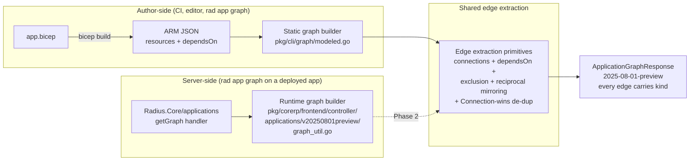

# Feature Specification: Application Graph Dependency Edges

**Feature Branch**: `edges` (in-progress; may be renamed to `004-graph-dependency-edges` at commit time)
**Created**: 2026-07-16
**Status**: Draft
**Input**: User description: "Insert all missing edges (because we have captured only connections so far). Use both `properties.connections` and Bicep-emitted `dependsOn` as edge sources. Exclude Radius.Core control-plane types (`applications`, `environments`, and other authoring-scope resources) from the graph. Apply the same rule to the **static** graph (built from `bicep build` JSON) first, and design it so the runtime deployed graph can reuse the same code path in a follow-up phase. Preserve edge direction — a container `dependsOn` a queue means container →(outbound) queue and queue ←(inbound) container."

## Clarifications

### Session 2026-07-16

- Q: Which API surface receives the changes? → A: Only `Radius.Core/2025-08-01-preview`. `Applications.Core` API versions, handlers, generated code, and tests are out of scope for this feature.
- Q: Do we need a discriminator on `ApplicationGraphConnection` so consumers can tell an author-declared connection from an implicit dependency? → A: **Yes.** Add a `kind` field to `ApplicationGraphConnection` on the `Radius.Core/2025-08-01-preview` model, with values `Connection` (author-declared, from `properties.connections`) and `Dependency` (implicit, from `dependsOn`). Useful for troubleshooting and for future renderer visual treatment. Applications.Core stays unchanged.
- Q: How is a source-target pair signaled by **both** `properties.connections` and `dependsOn` reconciled on the wire? → A: **Connection wins.** Emit exactly one edge for the pair, tagged `Connection`. `Dependency` is the fallback tag used only when the pair has no matching `connections` block.

## Purpose

The application graph today under-reports the real dependency structure of an application.

- Edges are emitted only from `properties.connections` (an author-declared block). A container that reads a queue via `secretKeyRef` on the queue's managed secret, but does not declare a `connections` block for it, produces **no edge** in the graph — even though Bicep's `dependsOn` already knows the container depends on the queue.
- The `Radius.Core/applications` resource shows up as a **graph node** in the static graph because the CLI-side modeled-graph filter only excludes the legacy `Applications.Core` namespace. This clutters the visualization with a control-plane resource that is a **containment scope**, not a graph member.

This feature closes both gaps together. It (1) treats Bicep's compiled `dependsOn` list as a **second edge source** alongside `properties.connections`, tagged with `kind: Dependency` so troubleshooting and renderers can tell it apart, and (2) excludes every `Radius.Core/*` control-plane type — starting with `applications` and `environments` — from graph nodes and from dependency scanning. Both changes land first in the **static** graph (`pkg/cli/graph/modeled.go`), and the extraction is factored so the **runtime** graph handler (`pkg/corerp/frontend/controller/applications/v20250801preview/graph_util.go`) can consume the same primitives in a follow-up phase.

All wire changes are confined to the `Radius.Core/2025-08-01-preview` API surface. `Applications.Core` is untouched.

The visible outcome for the `rabbitmq-app` (../../../my-radius-recipes/deploy/edges/rabbitmq-app.bicep) example: the static graph JSON contains **two nodes** (`consumer`, `rabbitmq`) instead of three. The `consumer` node has one outbound edge to `rabbitmq` tagged `Connection` — the author-declared connection is present and the implicit `dependsOn: ["rabbitmq"]` de-duplicates into it because Connection wins. The queue has the mirrored inbound edge, also tagged `Connection`. Every remaining `dependsOn` entry that targets a `Radius.Core/*` control-plane resource (e.g. `dependsOn: ["app"]`) is dropped along with the node itself.

## System context

Two graph producers, one shared extractor.

## Concrete example — rabbitmq-app

The bicep at `rabbitmq-app.bicep` (../../../my-radius-recipes/deploy/edges/rabbitmq-app.bicep) declares three resources: `app` (a `Radius.Core/applications`), `rabbitmq` (a `Radius.Messaging/rabbitMQ`), and `consumer` (a `Radius.Compute/containers`). The consumer resource declares one authored connection to `rabbitmq` and reads the queue's managed secret via `secretKeyRef` on `rabbitmq.properties.secrets.name`.

`bicep build` emits (`rabbitmq-app.json` — ../../../my-radius-recipes/deploy/edges/rabbitmq-app.json):

- `rabbitmq.dependsOn = ["app"]` — the queue depends on the application scope.
- `consumer.dependsOn = ["app", "rabbitmq"]` — the container depends on the application scope **and** the queue (the queue dependency comes from the `secretKeyRef` and from the `connections.rabbitmq.source: [reference('rabbitmq').id]`).
- `consumer.properties.connections.rabbitmq.source = "[reference('rabbitmq').id]"` — an author-declared connection.

Today's static graph output (`static-graph-rabbit.json` — ../../../my-radius-recipes/deploy/edges/static-graph-rabbit.json) shows the `app` node as a graph member and only one edge on `consumer` (the connection-block edge, untagged). This feature changes that output to:

| Node                                 | Direction | Target                              | Kind        | Origin                                                                                        |
| ------------------------------------ | --------- | ----------------------------------- | ----------- | --------------------------------------------------------------------------------------------- |
| `Radius.Compute/containers/consumer` | Outbound  | `Radius.Messaging/rabbitMQ/rabbitmq` | Connection  | `properties.connections.rabbitmq.source` — `dependsOn: ["rabbitmq"]` de-duplicates in (Connection wins) |
| `Radius.Messaging/rabbitMQ/rabbitmq` | Inbound   | `Radius.Compute/containers/consumer` | Connection  | mirrored from the outbound edge with the same `kind`                                          |
| `Radius.Messaging/rabbitMQ/rabbitmq` | Outbound  | (nothing — `app` is excluded)       | —           | `dependsOn: ["app"]` targets an excluded `Radius.Core/*` type                                  |

The `Radius.Core/applications/rabbitmq-app` node is **not present** in the resource list. Two graph nodes remain. Every edge on the wire carries a `kind`.

## Two-phase rollout

**Phase 1 (this spec): static graph + wire change.**

- Wire model: `ApplicationGraphConnection` on `Radius.Core/2025-08-01-preview` gains a `kind` field. `Applications.Core` is unchanged.
- Static graph builder: emits `Connection` and `Dependency` edges into the new field.
- Runtime graph handler (Radius.Core preview): sets `kind: Connection` on every edge it emits. No `Dependency` edges yet — the runtime doesn't have `dependsOn`, and Phase 2 will surface them by extending the `GetGraphRequest` wire to accept caller-supplied `dependsOnEdges`.
- Runtime graph handler (`Applications.Core`): untouched.

**Phase 2 (follow-up, out of scope for this spec): runtime dependency extraction.**

The same extraction primitives — connection resolution, dependency resolution against a resource-ID set, exclusion of `Radius.Core/*` control-plane types, reciprocal mirroring, and Connection-wins de-duplication — are lifted into a shared package the runtime handler consumes. See [Follow-up work](#follow-up-work-phase-2).

## Authoring & consumption flow (Phase 1)

```mermaid
flowchart TD
    A[Author writes app.bicep] --> B[bicep build]
    B --> C[ARM JSON with resources +<br/>connections + dependsOn]
    C --> D[rad app graph -f template.json<br/>or rad deploy --dry-run]
    D --> E[Static graph builder]
    E --> F1[Exclude Radius.Core/*<br/>control-plane types]
    F1 --> F2[For each remaining resource:]
    F2 --> G1[Collect Connection edges<br/>from properties.connections]
    F2 --> G2[Collect Dependency edges<br/>from dependsOn]
    G2 --> H[Resolve dependsOn tokens →<br/>fully-qualified resource IDs]
    H --> I[Drop IDs that resolve to<br/>an excluded type or are not<br/>in the resource list]
    G1 --> J[De-dup on &#40;source, target&#41;:<br/>Connection wins over<br/>Dependency]
    I --> J
    J --> K[Mirror each outbound edge<br/>as inbound on the target,<br/>preserving kind]
    K --> L[ApplicationGraphResponse<br/>Radius.Core/2025-08-01-preview<br/>every edge carries kind]
```

## User Scenarios *(mandatory)*

### Story 1 — Container-to-managed-resource dependency surfaces without a connections block (Priority: P1)

An application author reads a resource's managed secret via `secretKeyRef` without declaring a `properties.connections` block. Compiling the app and viewing the static graph shows an edge from the consuming container to the managed resource, tagged `kind: Dependency`, so the graph reflects the real deployment order and troubleshooting can tell an implicit dependency apart from an author-declared connection.

**Why this priority**: This is the observed gap driving the feature. Real applications routinely use `secretKeyRef`, `configMapKeyRef`, or embedded `.id` references without a `connections` block; the graph silently omits those edges today and misrepresents dependencies.

**Independent Test**: Compile `rabbitmq-app.bicep` (../../../my-radius-recipes/deploy/edges/rabbitmq-app.bicep) with `bicep build`, run the static-graph builder on the resulting JSON, assert the `consumer` node's outbound edges include exactly one edge to `rabbitmq` tagged `Connection` (Connection wins over the same-pair `Dependency`).

**Acceptance Scenarios**:

1. **Given** an app with a container reading `secretKeyRef: rabbitmq.properties.secrets.name` and no `connections` block on the container, **When** the static graph is built, **Then** the container node has one outbound edge to the queue tagged `Dependency` and the queue has a mirrored inbound edge tagged `Dependency`.
2. **Given** an app where the container has both a `connections` block to the queue **and** a `dependsOn` on the queue (as `rabbitmq-app.json` — ../../../my-radius-recipes/deploy/edges/rabbitmq-app.json — shows), **When** the static graph is built, **Then** exactly one edge appears between the two nodes tagged `Connection` (Connection wins).

---

### Story 2 — Radius.Core control-plane resources do not appear as graph nodes (Priority: P1)

An application author views the static graph of an app that declares a `Radius.Core/applications` resource for scoping. The `applications` resource does not appear in the graph nodes, and `dependsOn: ["app"]` entries emitted for it by every child do not produce edges.

**Why this priority**: `Radius.Core/applications` is a containment scope, not a runtime graph member. Rendering it as a node clutters the visualization with a resource that has no meaningful "connection" to its children. It's the concrete symptom the user hit first (`rabbitmq-app` showing as a node).

**Independent Test**: Build the static graph for `rabbitmq-app.bicep` (../../../my-radius-recipes/deploy/edges/rabbitmq-app.bicep) and assert (a) `resources` contains exactly two nodes, and (b) neither has an edge — outbound or inbound — whose target is `.../Radius.Core/applications/rabbitmq-app`.

**Acceptance Scenarios**:

1. **Given** a Bicep template that declares a `Radius.Core/applications` resource and several member resources whose Bicep source references it via `application: app.id`, **When** the static graph is built, **Then** the `Radius.Core/applications` resource is not present in the `resources` array of the response.
2. **Given** the same template where every member emits `dependsOn: ["app"]` in the compiled JSON, **When** the static graph is built, **Then** no member emits a `Dependency` edge targeting the `Radius.Core/applications` ID.
3. **Given** additional `Radius.Core/*` types are added to the exclusion list (per FR-005), **When** the static graph is built for a template containing any of them, **Then** they behave identically to `applications` — no node, no edges.

---

### Story 3 — Runtime graph on Radius.Core preview gains `kind` but stays behavior-equivalent; Applications.Core untouched (Priority: P1)

A deployed application viewed via `rad app graph` (the runtime graph, served by the control plane) continues to render exactly as it does today for existing consumers. The only observable change on `Radius.Core/2025-08-01-preview` is that every emitted edge now carries `kind: Connection`. Applications.Core responses are byte-identical.

**Why this priority**: Phase 1 must not regress the runtime graph. The wire-model change is additive on the Radius.Core preview only, and defaults to `Connection` for every edge the runtime handler emits (the runtime has no `dependsOn` source, so every current edge is a `Connection`).

**Independent Test**: For every existing runtime-graph fixture:

- Applications.Core fixtures: assert byte-identical response to the pre-change golden output.
- Radius.Core/2025-08-01-preview fixtures: assert the response matches the pre-change golden output except every emitted `connections` entry gains `"kind": "Connection"`.

**Acceptance Scenarios**:

1. **Given** any existing Applications.Core runtime-graph fixture, **When** the handler runs against it after this feature lands, **Then** the emitted response is byte-identical to the pre-change golden file.
2. **Given** any existing Radius.Core/2025-08-01-preview runtime-graph fixture, **When** the handler runs against it after this feature lands, **Then** the emitted `connections` array is byte-identical to the pre-change output except every entry gains `"kind": "Connection"`.
3. **Given** a deployed app whose Radius.Core preview runtime response would previously show `Radius.Core/applications` as a node, **When** the handler runs, **Then** the response is unchanged apart from the `kind` addition — runtime `Radius.Core/*` exclusion is a Phase 2 concern.

---

### Story 4 — Shared extraction primitives keep Phase 2 cheap (Priority: P2)

The runtime graph handler (Phase 2) reuses the same connection-resolution, dependency-resolution, exclusion, mirroring, and Connection-wins de-duplication code as the static builder. Adding runtime dependency edges is a wiring change, not a re-implementation.

**Why this priority**: Design-time discipline. Not shipped in Phase 1 but validated by inspection: a code reviewer walking the Phase 1 PR should be able to point to the exported primitives that Phase 2 will call.

**Independent Test**: After Phase 1 lands, the Phase 2 PR adds no new dependency-scan implementation — it only calls the extractor from the runtime handler and switches the exclusion list on.

**Acceptance Scenarios**:

1. **Given** the Phase 1 diff, **When** a reviewer searches for the string-matching and resolution logic, **Then** it lives in an exported package (not inline in `modeled.go`) and every input is a pure Go value already available to the runtime handler (no `*http.Request`, no CLI-only state).

---

### Edge Cases

- **`dependsOn` targets an unresolvable symbolic name** (broken template) → drop the edge silently, do not fail the graph build. Rationale: `bicep build` would have failed already for a real broken template; robustness against synthetic/partial fixtures is cheap.
- **`dependsOn` targets a Radius.Core type in the exclusion list** → drop the edge (Story 2 case #2).
- **`properties.connections.<name>.source` targets a Radius.Core type** (author wrote `connections.env = { source: env.id }`) → drop the edge with the same rule; author-declared or not, excluded targets are never rendered.
- **Same source-target pair is signaled by both a `connections` block and a `dependsOn` entry** → emit exactly one edge tagged `Connection`. Connection wins over Dependency; this is the `rabbitmq-app` case.
- **Same target appears multiple times in `dependsOn`** → emit exactly one `Dependency` edge.
- **Same source, same target, both edges via different sources on the same resource (fan-in from A→C=Connection and B→C=Dependency)** → C receives two inbound edges: one from A tagged `Connection`, one from B tagged `Dependency`. Mirroring preserves each source's `kind` because the source-target pair is different (different sources).
- **`dependsOn` uses the symbolic-name form (languageVersion 2.0)** vs the `[resourceId(...)]` form (languageVersion 1.x) → both must resolve to the same canonical ID via the existing symbol-table normalization in `collectResources`.
- **Symbolic entry in the exclusion list is referenced by another `dependsOn`** → the reference is dropped after the excluded target is filtered out, not before symbol resolution (so the `["app"]` token in `rabbitmq-app.json` first resolves to `Radius.Core/applications/rabbitmq-app`, then the exclusion rule fires).
- **A `Radius.Core/*` type that is *not* in the exclusion list** (e.g. a future Radius.Core type intended to be a graph member) → treated as a normal graph node; the exclusion is an explicit allow-list of "control-plane containment scopes," not a wildcard on the namespace. See FR-005.
- **Environment resource** (`Radius.Core/environments`) authored inside an app template → same treatment as `applications`: excluded as a node and as an edge target.

## Requirements *(mandatory)*

### Exclusion of control-plane types

- **FR-001**: The static graph builder MUST NOT emit a graph node for any resource whose `type` matches an entry in the control-plane-type exclusion list.
- **FR-002**: The static graph builder MUST NOT emit an edge — `Connection` or `Dependency`, outbound or inbound — whose source or target resolves to a resource of an excluded type.
- **FR-003**: Recipe-catalog resources currently filtered out by `modeled.go` (`Radius.Core/recipePacks`) MUST remain filtered under the same rule; adding this feature MUST NOT re-introduce them as nodes.
- **FR-004**: The exclusion list applies before de-duplication and reciprocal-mirroring, so a self-loop or mirror edge never targets an excluded type.
- **FR-005**: The exclusion list is defined explicitly in code (a Go slice or set of type strings) — it is **not** derived from the `Radius.Core` namespace prefix. Starting membership:
  - `Applications.Core/applications` — legacy namespace, already filtered.
  - `Applications.Core/environments` — legacy namespace, already filtered.
  - `Radius.Core/applications` — new; this is the observed regression.
  - `Radius.Core/environments` — new.
  - `Radius.Core/recipePacks` — already filtered.

  Any additional `Radius.Core/*` types added later are added by editing this list, not by wildcard.

### Edge sources

- **FR-006**: `Connection` edges MUST continue to be emitted from `properties.connections[*].source`, with the wire model now carrying an explicit `kind: Connection` on each entry.
- **FR-007**: `Dependency` edges MUST be emitted from the compiled ARM template's per-resource `dependsOn` array. Every entry is resolved to a fully-qualified Radius resource ID using the same symbol-table + `[resourceId(...)]` resolution `resolveDependsOn` uses today for `DiffHash`.
- **FR-008**: A `Dependency` edge MUST be dropped when:
  - it resolves to a type in the exclusion list (FR-002), or
  - the same source-target pair is already emitted as a `Connection` edge for that resource (Connection-wins de-duplication, FR-011), or
  - it cannot be resolved to a target that is present in the graph's resource list.
- **FR-009**: `Dependency` edge resolution MUST handle both ARM languageVersion 1.x (`[resourceId('TYPE','NAME')]` strings) and languageVersion 2.0 (symbolic-name strings) via the existing `collectResources` / symbol-table path.
- **FR-010**: For every outbound edge, the builder MUST emit a reciprocal inbound edge on the target node with the same `kind`.

### De-duplication

- **FR-011**: When the same source-target pair on the same resource is signaled by both `properties.connections` and `dependsOn`, the builder MUST emit exactly one edge and MUST tag it `Connection`. **Connection wins.** The `Dependency` tag is emitted only when the pair has no matching `connections` block.
- **FR-012**: Multiple `dependsOn` tokens targeting the same resource MUST collapse to one `Dependency` edge.

### Wire contract

- **FR-013**: `ApplicationGraphConnection` on the `Radius.Core/2025-08-01-preview` TypeSpec MUST gain a `kind` field with values `Connection` (author-declared, from `properties.connections`) and `Dependency` (implicit, from `dependsOn`). The field is required on the response — every emitted edge carries a `kind`. Field name and enum name (working name: `ConnectionKind`) are firmed up during `speckit.plan`.
- **FR-014**: The `Radius.Core/2025-08-01-preview` runtime graph handler (`pkg/corerp/frontend/controller/applications/v20250801preview/graph_util.go`) MUST set `kind: Connection` on every edge it emits. It does **not** produce `Dependency` edges in Phase 1 — caller-supplied `dependsOnEdges` on `GetGraphRequest` is Phase 2.
- **FR-015**: The static graph builder MUST set `kind` on every edge — `Connection` or `Dependency` — including mirrored inbound edges.
- **FR-016**: `Applications.Core` TypeSpec, generated code, handlers, and tests MUST NOT change. The wire change is scoped to `Radius.Core/2025-08-01-preview` only.

### Reuse (Phase 2 preparation)

- **FR-017**: The static graph's dependency-resolution and exclusion logic MUST be implemented as exported primitives in a package callable from both `pkg/cli/graph/` and `pkg/corerp/frontend/controller/applications/v20250801preview/`. No CLI-only state (`http.Request`, `*flag.FlagSet`, `sdk.Connection`) may appear in the primitive signatures. Package location is firmed up during `speckit.plan`.
- **FR-018**: The primitives' input is a pure Go representation: a list of resources with a canonical ID, `properties`, and a `dependsOn` slice already resolved to canonical IDs. Callers convert their own inputs into this shape.
- **FR-019**: The primitives MUST NOT reach into ARM template syntax (`[resourceId(...)]`, `[reference(...)]`) — that resolution stays in `modeled.go` for the static caller, and is a no-op for the runtime caller.

### Documentation

- **FR-020**: [docs/architecture/application-graph.md](../../../docs/architecture/application-graph.md) MUST be updated to describe (a) the two edge sources (`connections` and `dependsOn`), (b) the exclusion list, (c) the new `kind` field on Radius.Core preview, and (d) the Connection-wins de-duplication rule. It MUST call out that `Applications.Core` is unchanged.
- **FR-021**: The former design note `eng/design-notes/graph/2026-07-implicit-id-dependencies-in-app-graph.md` has been superseded by this spec and removed, so [docs/architecture/application-graph.md](../../../docs/architecture/application-graph.md) and this spec are the only sources of truth on the graph edge contract.

### Key Entities

- **Resource**: A single Radius resource in the graph. Attributes used by this feature: canonical resource ID, `type`, `properties`, and a resolved `dependsOn` (a list of canonical target IDs).
- **Edge**: A directed relationship between two resources. Wire attributes on `Radius.Core/2025-08-01-preview`: `source`, `target`, `direction` (`Outbound` or `Inbound`), `kind` (`Connection` or `Dependency`).
- **Exclusion list**: A set of resource-type strings whose members are never nodes and never edge targets.

## Success Criteria *(mandatory)*

### Measurable Outcomes

- **SC-001**: For the `rabbitmq-app` (../../../my-radius-recipes/deploy/edges/rabbitmq-app.bicep) fixture, the static graph response contains exactly **2 nodes** (`consumer`, `rabbitmq`), zero `Radius.Core/applications` nodes, and the single edge between the two nodes is tagged `Connection`.
- **SC-002**: For a fixture where a container reads a queue's managed secret via `secretKeyRef` but declares no `connections` block, the static graph response contains **1 outbound `Dependency` edge** on the container to the queue and **1 mirrored inbound `Dependency` edge** on the queue.
- **SC-003**: Runtime-graph regression coverage in Phase 1:
  - 100% of existing `Applications.Core` runtime-graph tests produce byte-identical responses to their pre-change golden files.
  - 100% of existing `Radius.Core/2025-08-01-preview` runtime-graph tests produce responses byte-identical to their pre-change golden files **except** every emitted edge gains `"kind": "Connection"`.
- **SC-004**: A reviewer inspecting the Phase 1 diff can identify the exported extraction primitives in a shared package; a follow-up prototype call from the `Radius.Core/2025-08-01-preview` runtime handler compiles without duplicating any dependency-resolution logic.
- **SC-005**: The exclusion list is a single Go source location; adding a new excluded type is a one-line edit plus one new test case.

## Assumptions

- Radius resources are addressable by canonical resource ID and every graph node in scope carries one.
- `bicep build` continues to emit `dependsOn` for every literal-argument `.id` reference. This is Microsoft's documented behavior ([Azure Resource Manager: resource dependencies](https://learn.microsoft.com/en-us/azure/azure-resource-manager/bicep/resource-dependencies)) and is already relied on by `DiffHash`.
- `properties.connections[*].source` continues to be an ARM expression resolvable to a canonical resource ID via `collectResources` / `rewriteSymbolicConnections`.
- The runtime graph's edge extractor is intentionally simpler than the static one because deployed resources do not carry `dependsOn`. Runtime `Dependency` extraction (Phase 2) does not attempt to reconstruct `dependsOn` on the server; instead, the `GetGraphRequest` wire grows an optional `dependsOnEdges` field that callers (typically `rad app graph -a <app>` after a fresh `bicep build`, or the deployment engine) supply. The server merges those edges into the connection-only graph it already builds. No property scanning on stored resources.
- The `kind` field on Radius.Core preview is additive; consumers that do not read it continue to work. Consumers that opt in (renderers, troubleshooting tools) can differentiate `Connection` vs `Dependency`.
- `Applications.Core` API versions are frozen for this feature.

## Follow-up work (Phase 2)

Tracked separately once Phase 1 lands:

1. **Caller-supplied `dependsOnEdges` on the runtime API.** Extend `GetGraphRequest` on `Radius.Core/2025-08-01-preview` with an optional `dependsOnEdges` field. Clients that have just compiled a Bicep template pass the extracted edges to the server; the server tags them `Kind: Dependency` and merges them into the graph it builds from stored resources via the shared primitives (FR-017), applying the same Connection-wins de-dup and reciprocal mirroring. Explicitly not a server-side property scanner — the authoritative source of `dependsOn` is Bicep's compiled template, held by the caller.
2. **Runtime exclusion list.** Apply the same `Radius.Core/*` exclusion in the `Radius.Core/2025-08-01-preview` runtime graph handler.
3. **Renderer visual treatment.** Update CLI and dashboard renderers to render `Dependency` edges distinctly from `Connection` edges (dotted vs solid line, legend, etc.).
4. **Additional `Radius.Core/*` types.** As new control-plane types are added, extend the exclusion list. Every extension is one line of code + one test case (SC-005).

## Out of Scope

- Runtime graph handler emission of `Dependency` edges (there is no `dependsOn` at runtime).
- Any change to `Applications.Core` TypeSpec, generated code, handlers, or tests.
- Any change to `dynamicrp` or the deployment engine's dependency ordering.
- Any change to `properties.connections` semantics (`iam`, `disableDefaultEnvVars`, direction inference) — this feature adds a discriminator field only.
- Renderer-side visual language for the new `kind` field — that is Phase 2 or later.
