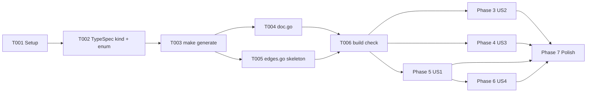

# Tasks: Application Graph Dependency Edges

**Input**: Design documents from `specs/004-graph-dependency-edges/`
**Prerequisites**: [spec.md](spec.md), [plan.md](plan.md), [research.md](research.md), [data-model.md](data-model.md), [contracts/wire-change.md](contracts/wire-change.md)

**Tests**: Included. Constitution IV ("Testing Pyramid Discipline") is non-negotiable for the Radius Go codebase — every code task has an associated unit-test task.

**Organization**: Tasks are grouped by user story so each P1 story can be implemented and shipped independently. Task IDs are stable across phases; `[P]` means the task can run in parallel with other `[P]` tasks in the same phase.

## Format: `[ID] [P?] [Story] Description`

- **[P]**: Can run in parallel with other `[P]` tasks in the same phase (different files, no dependencies).
- **[Story]**: `US1`, `US2`, `US3`, `US4`, or `Foundation` / `Polish`.

## Path Conventions

Single Go module `github.com/radius-project/radius`; feature-specific paths per [plan.md § Project Structure](plan.md#project-structure).

---

## Phase 1: Setup

**Purpose**: Confirm the spec-kit deliverable is in place; nothing to compile yet.

- [ ] T001 [Foundation] Verify `specs/004-graph-dependency-edges/` contains `spec.md`, `plan.md`, `research.md`, `data-model.md`, `contracts/wire-change.md`, `quickstart.md`, and `checklists/requirements.md`. No source-code changes in this task.

---

## Phase 2: Foundational (Blocking Prerequisites)

**Purpose**: Wire-model change + new package skeleton. All three P1 stories consume these outputs. **No US1/US2/US3 story work may start until Phase 2 is complete.**

- [ ] T002 [Foundation] Update `typespec/Radius.Core/applications.tsp`: add `enum ConnectionKind { Connection, Dependency }` and the required `kind: ConnectionKind` field on `ApplicationGraphConnection`. Follow the exact diff in [contracts/wire-change.md](contracts/wire-change.md).
- [ ] T003 [Foundation] Run `make generate` at repo root. Commit the regenerated `pkg/corerp/api/v20250801preview/zz_generated_models.go`, `swagger/specification/core/resource-manager/Radius.Core/preview/2025-08-01-preview/applications.json`, and any Bicep type extensions produced by the same target.
- [ ] T004 [P] [Foundation] Create `pkg/graph/edges/doc.go` with the package-level godoc summarizing purpose (edge extraction primitives shared by static and runtime graph builders) and the Phase 2 plug-in point.
- [ ] T005 [P] [Foundation] Create `pkg/graph/edges/edges.go` with the exported types from [data-model.md](data-model.md#pkggraphedges--go-types): `Resource` and `Edge`. Include a stub `ExtractEdges(resources []Resource, excluded map[string]struct{}) []Edge` that returns `nil`. Every exported symbol has godoc; the doc comment on `ExtractEdges` names the promotion path to an options struct if a second knob emerges.
- [ ] T006 [Foundation] Verify the workspace compiles: `go build ./...`. Verify the new field is visible in the generated Go model: `grep -n 'Kind' pkg/corerp/api/v20250801preview/zz_generated_models.go`.

**Checkpoint**: Wire has `kind`; new package exists; workspace compiles. P1 stories can now proceed in parallel per their dependency map below.

---

## Phase 3: User Story 2 — Radius.Core control-plane exclusion (Priority: P1) 🎯 smallest slice

**Goal**: `Radius.Core/applications` and `Radius.Core/environments` never appear as graph nodes or edge targets in the static graph.

**Independent Test**: `rabbitmq-app` fixture produces exactly 2 nodes; no edge (outbound or inbound) targets `Radius.Core/applications/rabbitmq-app`.

**Depends on**: Phase 2 (compiling workspace only).

### Implementation

- [ ] T007 [US2] Extend the exclusion list in `pkg/cli/graph/modeled.go` to include `Radius.Core/applications` and `Radius.Core/environments` alongside the existing `Applications.Core/applications`, `Applications.Core/environments`, and `Radius.Core/recipePacks` entries. Keep the list a single source location per FR-005.
- [ ] T008 [US2] Add or extend table-driven cases in `pkg/cli/graph/modeled_test.go` for:
  - Fixture with `Radius.Core/applications` declared → assert `resources` has exactly 2 nodes and none has `type == "Radius.Core/applications"`.
  - Same fixture where every member emits `dependsOn: ["app"]` → assert no edge targets the excluded application ID.
  - Additional `Radius.Core/environments` entry → same treatment as `applications`.
- [ ] T009 [US2] Run `go test ./pkg/cli/graph/...`. All existing modeled-graph tests must still pass; new cases must be green.

**Checkpoint (US2)**: The immediate `rabbitmq-app`-shows-as-a-node regression is fixed. This slice is independently mergeable.

---

## Phase 4: User Story 3 — Runtime `kind: Connection` on Radius.Core preview (Priority: P1)

**Goal**: The `Radius.Core/2025-08-01-preview` runtime graph handler emits `kind: Connection` on every edge. `Applications.Core` (any version) is byte-identical to before.

**Independent Test**: Existing Applications.Core golden files unchanged; Radius.Core/2025-08-01-preview golden files updated only to gain `"kind": "Connection"` on every `connections` entry.

**Depends on**: Phase 2.

### Implementation

- [ ] T010 [US3] In `pkg/corerp/frontend/controller/applications/v20250801preview/getgraph.go`, locate the site that converts the internal edge representation to `*corerpv20250801preview.ApplicationGraphConnection`. Set `Kind: to.Ptr(corerpv20250801preview.ConnectionKindConnection)` on every emitted entry (outbound and inbound). No other logic changes.
- [ ] T011 [P] [US3] Update `pkg/corerp/frontend/controller/applications/v20250801preview/getgraph_test.go` golden expectations: every `connections` entry gains `"kind": "Connection"`. If snapshot files live under `testdata/`, regenerate them and commit the diff.
- [ ] T012 [P] [US3] Update `pkg/corerp/frontend/controller/applications/v20250801preview/graphicons_test.go` golden expectations (if graph icons tests exercise a connections array). Only `kind: Connection` should differ from pre-change goldens.
- [ ] T013 [US3] Run `go test ./pkg/corerp/frontend/controller/applications/...`. **Verify Applications.Core (the parent package) tests are byte-identical** — no `.golden` diff, no assertion changes. If Applications.Core tests fail, revert; the constraint (FR-016) is violated.

**Checkpoint (US3)**: Radius.Core preview responses carry `kind` uniformly. Applications.Core untouched. Independently mergeable.

---

## Phase 5: User Story 1 — Static-graph `Dependency` edges + Connection-wins de-dup (Priority: P1)

**Goal**: Static graph surfaces `dependsOn`-only edges tagged `kind: Dependency`, and merges the `connections + dependsOn` overlap to a single `kind: Connection` edge.

**Independent Test**: `rabbitmq-app` fixture emits exactly one edge between `consumer` and `rabbitmq` tagged `Connection`. A variant with the container's `connections` block removed but `secretKeyRef` intact emits exactly one edge tagged `Dependency`.

**Depends on**: Phase 2, Phase 3 (converter must know how to set `Kind` per edge). Not dependent on Phase 4's runtime work; can proceed in parallel with US3.

### Implementation

- [ ] T014 [US1] Implement `ExtractEdges` in `pkg/graph/edges/edges.go` per [data-model.md](data-model.md):
  - Iterate `resources`; skip those whose `Type` is in `excluded`.
  - Collect `Connection` edges from `properties.connections[*].source` (canonical Radius IDs; drop what cannot be parsed, drop excluded targets, drop targets not in the resource-ID set).
  - Collect `Dependency` edges from `DependsOn` (drop excluded targets, drop targets not in the resource-ID set).
  - Connection-wins de-dup on `(Source, Target)` per source resource (FR-011); collapse duplicate `Dependency` tokens (FR-012).
  - Mirror every outbound edge as inbound on the target with the same `Kind` (FR-010).
  - Return a slice sorted deterministically by `(Source, Target, Direction, Kind)`.
- [ ] T015 [US1] Add `pkg/graph/edges/edges_test.go` table-driven unit tests covering:
  - Empty inputs → empty output.
  - Single `Connection` edge → outbound + mirrored inbound, both tagged `Connection`.
  - Single `Dependency` edge → outbound + mirrored inbound, both tagged `Dependency`.
  - Same pair from both sources → single `Connection` edge (Connection wins).
  - Multiple `Dependency` tokens on same target → single `Dependency` edge.
  - Fan-in with mixed kinds from different sources (A→C=Connection, B→C=Dependency) → C has two distinct inbound edges preserving each source's kind.
  - Excluded target → no edge emitted, mirror not emitted either.
  - Target not in resource-ID set → edge dropped.
  - Sorted output determinism → shuffle inputs, output identical.
- [ ] T016 [US1] Refactor `pkg/cli/graph/modeled.go`:
  - Build the exclusion set `map[string]struct{}{...}` from the existing constants.
  - After the existing resource-list construction, build `[]edges.Resource` from each entry: `Type` from `entry["type"]`, `Properties` from `entry["properties"]`, `DependsOn` from `resolveDependsOn(entry["dependsOn"])` (canonical IDs, ARM syntax already stripped).
  - Call `edges.ExtractEdges(resources, excludedSet)`.
  - Convert each returned `edges.Edge` back into `*corerpv20250801preview.ApplicationGraphConnection` on the owning source node's `Connections` slice, setting `Direction`, `ID` (the target), and `Kind` per edge. Attach mirrored inbound entries the same way.
  - Remove the now-obsolete inline connection extraction (`outboundConnections`, `addInboundConnections`) once tests pass. Keep them if lifting them is invasive; the goal is correctness of the emitted graph.
- [ ] T017 [P] [US1] Extend `pkg/cli/graph/modeled_test.go`:
  - `rabbitmq-app` fixture: assert 2 nodes; assert `consumer.Connections` contains exactly one entry with `Direction=Outbound`, `ID=…/rabbitMQ/rabbitmq`, `Kind=Connection`; assert `rabbitmq.Connections` has the mirrored `Inbound`/`Connection` entry; assert `rabbitmq.Connections` has no outbound entry to `Radius.Core/applications`.
  - Variant fixture (container has no `connections` block, only `dependsOn: ["rabbitmq"]`): same shape, but `Kind=Dependency` on both entries.
  - Fan-in fixture: two containers each `dependsOn` one shared queue — one via `connections`, one via `dependsOn` only — assert the queue has two inbound entries with the correct mixed kinds.
- [ ] T018 [US1] Run `go test ./pkg/graph/edges/... ./pkg/cli/graph/...`. All existing and new cases green.

**Checkpoint (US1)**: Static graph surfaces implicit dependency edges tagged `Dependency`; overlaps de-dup to `Connection`. This is the headline slice.

---

## Phase 6: User Story 4 — Shared-primitives reuse discipline (Priority: P2)

**Goal**: The Phase 1 diff leaves the extractor callable by the runtime handler in Phase 2 with no CLI-specific dependencies.

**Independent Test**: `pkg/graph/edges/` imports no `pkg/cli/`, no `pkg/corerp/`, no `net/http`, no ARM template syntax.

**Depends on**: Phase 5 (extractor must exist first).

### Implementation

- [ ] T019 [US4] Run `go list -deps ./pkg/graph/edges/... | grep -E 'pkg/cli|pkg/corerp|net/http'`. Expected output: empty. If not empty, refactor to remove the offending imports.
- [ ] T020 [US4] Add a doc-comment block on `ExtractEdges` in `pkg/graph/edges/edges.go` naming the Phase 2 plug-in point:
  > "Runtime callers (Phase 2) populate `Resource.DependsOn` from caller-supplied `dependsOnEdges` on the `GetGraphRequest` wire, not from server-side property scanning. Static callers populate it from Bicep's `dependsOn` array via `resolveDependsOn`. The extractor is agnostic to how `DependsOn` was resolved."

**Checkpoint (US4)**: Runtime plug-in is documented and structurally supported. Phase 2 becomes a wiring change.

---

## Phase 7: Polish & Documentation

**Purpose**: Docs and cross-cutting cleanup after all P1/P2 stories land.

- [ ] T021 [P] [Polish] Update [docs/architecture/application-graph.md](../../docs/architecture/application-graph.md) per FR-020:
  - Describe both edge sources (`connections` and `dependsOn`).
  - Describe the exclusion list and its membership.
  - Describe the new `kind` field on `Radius.Core/2025-08-01-preview` and the Connection-wins de-dup rule.
  - Call out explicitly that `Applications.Core` is unchanged (FR-016).
- [ ] T022 [P] [Polish] Run `gofmt -w pkg/graph/edges/ pkg/cli/graph/ pkg/corerp/frontend/controller/applications/v20250801preview/` and `go vet ./...`. Fix any diagnostics.
- [ ] T023 [P] [Polish] Run `golangci-lint run ./pkg/graph/edges/... ./pkg/cli/graph/... ./pkg/corerp/frontend/controller/applications/v20250801preview/...`. Fix any new warnings; zero baseline.
- [ ] T024 [Polish] Walk through [quickstart.md](quickstart.md) end-to-end against the `rabbitmq-app` fixture. All jq assertions in the quickstart must pass. This closes SC-001 and SC-002.
- [ ] T025 [Polish] Confirm regenerated artifacts (`zz_generated_models.go`, `swagger/**/applications.json`, Bicep types) match `make generate` output on the final tree; commit any drift.

---

## Dependency Graph

- **T004 and T005** run in parallel after T003.
- **T007 and T008** (US2), **T010 and T011/T012** (US3), and **T014 and T015** (US1) run within their own phase. `[P]` markers indicate what's parallelizable inside each phase.
- **US2, US3, and US1 can run in parallel** once Phase 2 is complete — they touch different files:
  - US2 → `pkg/cli/graph/modeled.go` + its test
  - US3 → `pkg/corerp/frontend/controller/applications/v20250801preview/*.go` + its test goldens
  - US1 → `pkg/graph/edges/*.go` + `pkg/cli/graph/modeled.go` (US1 will conflict with US2 on `modeled.go`; do US2 first, then rebase US1 on top)

## Suggested commit boundaries

Landing each phase as its own commit keeps review small and history clean:

1. `Foundation`: T001–T006 — one commit including the TypeSpec change, all regenerated files, and the empty `pkg/graph/edges/` package.
2. `US2`: T007–T009 — one commit fixing the immediate `Radius.Core/applications` node regression.
3. `US3`: T010–T013 — one commit adding `kind: Connection` on Radius.Core preview runtime responses.
4. `US1`: T014–T018 — one commit implementing `ExtractEdges` and switching `modeled.go` to consume it.
5. `US4`: T019–T020 — one commit documenting the Phase 2 plug-in point.
6. `Polish`: T021–T025 — one commit for docs + lint.

## Success mapping

| Success Criterion | Tasks that verify it |
|-------------------|----------------------|
| SC-001 (rabbitmq-app: 2 nodes, single Connection edge) | T008 (US2), T017 (US1), T024 (Polish) |
| SC-002 (secretKeyRef variant: single Dependency edge) | T017 (US1), T024 (Polish) |
| SC-003 (App.Core byte-identical; Radius.Core preview gains kind:Connection) | T013 (US3) |
| SC-004 (shared extractor in a neutral package) | T019 (US4) |
| SC-005 (exclusion list is one source location, one-line add + one test add) | T007, T008 (US2) |
