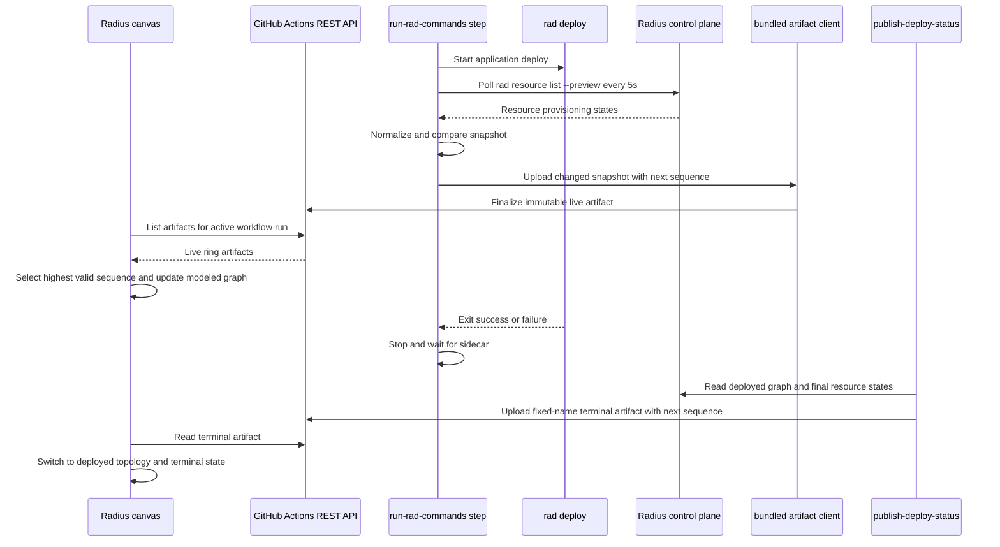

# Feature Specification: Live Deployment Graph Progress

**Feature Branch**: `live-graph`
**Created**: 2026-08-19
**Status**: Draft - awaiting approval
**Input**: Design live per-resource deployment graph updates by combining the workflow-artifact contract from [radius-project/radius#12628](https://github.com/radius-project/radius/pull/12628) with the in-step polling sidecar from [radius-project/radius#12584](https://github.com/radius-project/radius/pull/12584) and its canvas consumer prototype in [radius-project/ai-extensions#200](https://github.com/radius-project/ai-extensions/pull/200).

## Purpose

The Deployed graph currently receives one terminal snapshot after `rad deploy` returns. That snapshot is reliable and includes failed deployments, but it cannot show resources changing from pending to in progress to success or failure while deployment is underway.

PR #12584 demonstrated the missing producer signal: a background process in the `run-rad-commands` step can poll application resources while `rad deploy` is running. PR #12628 established the durable cross-repository contract: `deploy-progress.json` transported as a GitHub Actions artifact, with a `sequence` field reserved for multiple snapshots. This feature combines those ideas without returning to job-log parsing.

The existing non-preview `rad resource list -a <application>` command cannot supply that signal for applications authored as `Radius.Core/applications`: it validates and filters against the legacy `Applications.Core/applications` resource ID. This caused a successful `Radius.Core` deployment to publish `resources: []` while `rad app graph --preview` showed four succeeded resources. Live progress therefore requires a `rad resource list --preview` implementation that uses the `Radius.Core/2025-08-01-preview` application identity and resource model.

The same observed artifact exposed a second prerequisite: a deployed container graph included a plaintext database password under `properties.containers.<container>.env`. The graph currently relies on upstream list handlers to redact secrets, which is not a sufficient boundary for an artifact published from the graph response. This feature adds a defense-in-depth graph projection rule that removes the entire `properties.containers[*].env` subtree from every `Radius.Core/2025-08-01-preview` graph response before it can reach the CLI, logs, canvas, or workflow artifacts.

The live view uses the modeled application graph as its topology while deployment is running and overlays resource states from sequenced progress snapshots. After deployment, the existing fixed-name artifact remains the terminal source of truth and supplies the deployed graph, final progress, activity, control-plane diagnostics, and deploy summary.

## Decisions

### Transport

Live snapshots are GitHub Actions workflow artifacts uploaded from inside the running shell step through the official `@actions/artifact` client. The client uses the runner-provided `ACTIONS_RUNTIME_TOKEN` and `ACTIONS_RESULTS_URL`; the implementation does not reproduce GitHub's private artifact protocol with handwritten HTTP requests.

GitHub artifact v4+ archives are immutable and a name cannot be uploaded repeatedly. Live snapshots therefore use a bounded ring of artifact names rather than repeatedly overwriting the terminal artifact:

```text
radius-deploy-status-<environment>-<application>-live-<run-id>-slot-0
radius-deploy-status-<environment>-<application>-live-<run-id>-slot-1
...
radius-deploy-status-<environment>-<application>-live-<run-id>-slot-7
```

Each artifact contains one `deploy-progress.json`. A slot is deleted and recreated only when the ring wraps. Consumers order payloads by `(runId, sequence)`, never by artifact ID, creation time, list order, or slot number. Keeping eight slots bounds artifact count and storage while ensuring that deleting one slot never removes every readable live snapshot.

The terminal artifact keeps its existing stable name:

```text
radius-deploy-status-<environment>-<application>
```

It remains the repo-wide lookup target after a run finishes.

### Progress source

The sidecar starts only around a `rad deploy` whose normalized target is the configured application Bicep file. It does not start for `rad version`, environment or recipe-pack deployments, unrelated custom deploy commands, or command lists without an application deploy.

The sidecar resolves the application name with the same helper used by the terminal publisher, polls `rad resource list --preview -a <application> -o json` every five seconds, normalizes the Radius.Core response into the existing `deploy-progress.json` schema, and uploads only when the normalized resource snapshot changes. A failed poll or upload is warning-only and cannot alter the deploy command's exit code.

The terminal publisher uses the same preview command. It captures a sanitized error for the workflow log instead of discarding stderr, then publishes an empty resource list only as a best-effort fallback. This makes an API mismatch or control-plane failure observable without exposing credentials or failing the deployment.

### Graph data safety

Every `Radius.Core/2025-08-01-preview` application graph producer removes the complete environment-variable map from container properties:

```text
resources[type == "Radius.Compute/containers"].properties.containers[*].env
```

The `env` key is omitted, not emitted with redacted values and not replaced with an empty object. The rule is unconditional: it removes ordinary values, secret-derived values, unknown future environment-variable shapes, and values that upstream redaction failed to classify. Other container properties such as image, ports, volumes, and code references remain available to graph consumers.

The rule is applied in the shared Radius.Core preview graph projection so runtime and modeled graph responses obey the same contract. It does not depend on variable names such as `PASSWORD`, schema annotations, secure-parameter tracking, or the caller being the workflow publisher. Existing schema-aware and secure-parameter redaction remains in place as an additional layer.

### Sequence and terminal handoff

The first successfully published live snapshot has `sequence: 1`. Every subsequent changed snapshot increments the sequence. The sidecar persists its last allocated sequence in the runner temp directory before it exits.

The terminal `publish-deploy-status` action reads that checkpoint and publishes `sequence: lastLiveSequence + 1`. If no live snapshot was published, it retains the current `sequence: 1` behavior. The terminal payload's `state` is `succeeded`, `failed`, or `in_progress` under the semantics introduced by PR #12628.

The terminal snapshot wins for a run because it has the highest sequence. A stale live artifact discovered after the terminal artifact cannot regress a node.

### Graph topology

During a run, the canvas builds the modeled graph from the application Bicep file, removes resources excluded by the existing visualization rules, omits output-resource child nodes, and overlays statuses by canonical resource ID. Name plus type is a fallback only for older or partial payloads whose `id` is empty.

After the terminal artifact appears, the canvas switches to `deploy-graph.json` from that artifact and applies the final `deploy-progress.json`. If a deployed graph cannot be generated, the modeled topology remains visible with the final statuses that are available.

## System Context



## User Scenarios and Testing

### User Story 1 - Watch resources change state during deploy (Priority: P1)

A developer starts a deployment and opens the Deployed graph. Nodes begin pending, move to in progress as the control plane observes them, and become successful or failed without waiting for the full `rad deploy` command to return.

**Why this priority**: This is the feature's primary user value and the gap explicitly left by PR #12628.

**Independent Test**: Run a workflow against a stubbed `rad` whose resource-list output changes across polls and assert that the consumer renders each published sequence in order before the deploy process exits.

**Acceptance Scenarios**:

1. **Given** an active application deploy and no resource snapshot yet, **When** the Deployed graph opens, **Then** it renders the modeled topology with every node pending.
2. **Given** a resource changes from `Provisioning` to `Succeeded`, **When** changed snapshots are published, **Then** its node changes from in progress to success while the workflow remains active.
3. **Given** one resource reaches `Failed`, **When** the next snapshot is consumed, **Then** only that node becomes failed and already successful nodes remain successful.

---

### User Story 2 - Finish with an authoritative terminal graph (Priority: P1)

When deployment ends, the live graph converges on the terminal result from the existing fixed-name artifact. Successful and failed runs both retain a useful graph after the workflow and ephemeral control plane are gone.

**Why this priority**: Live status must not weaken the terminal behavior shipped by PR #12628.

**Independent Test**: Feed the consumer live sequences followed by a higher terminal sequence and assert that the terminal graph and statuses replace the modeled live projection and remain selected after workflow completion.

**Acceptance Scenarios**:

1. **Given** live sequences 1 through 4, **When** a terminal artifact with sequence 5 appears, **Then** the consumer selects sequence 5 and switches to the deployed topology.
2. **Given** the deploy command fails, **When** the terminal publisher runs under `!cancelled()`, **Then** it publishes `state: failed` and preserves any per-resource terminal states available from the control plane.
3. **Given** final graph generation fails, **When** terminal progress is still readable, **Then** the consumer keeps the modeled topology and applies the terminal progress instead of showing an empty view.

---

### User Story 3 - Preserve deploy reliability when reporting fails (Priority: P1)

Artifact-service, polling, parsing, and canvas failures never change whether an application deployment succeeds or fails.

**Why this priority**: Progress reporting is observability. It must remain best-effort, matching the contract reviewed in PR #12628.

**Independent Test**: Force every sidecar operation to fail while a stub deploy succeeds and assert that the action returns the deploy exit code, writes the command-result artifact, and runs cleanup.

**Acceptance Scenarios**:

1. **Given** the artifact runtime variables are unavailable, **When** a deploy runs, **Then** live publishing is disabled with one warning and deployment proceeds normally.
2. **Given** `rad resource list --preview` fails before the application exists, **When** a later poll succeeds, **Then** the sidecar publishes the later snapshot without having exited early.
3. **Given** an upload is interrupted, **When** the deploy step exits, **Then** cleanup kills and waits for the sidecar and preserves the deploy exit code.

---

### User Story 4 - Ignore unrelated commands and stale snapshots (Priority: P2)

Custom command lists can contain multiple deploys and non-deploy commands. Live graph reporting runs only for the configured application deploy, and the canvas rejects snapshots from another run, application, environment, or schema.

**Why this priority**: PR #12584's prototype started polling whenever it could parse an app name, including non-deploy commands. Correct gating prevents misleading status and unnecessary control-plane traffic.

**Independent Test**: Execute table-driven command-list cases and artifact fixtures covering unrelated deploy targets, duplicate sequences, malformed JSON, and mismatched identity fields.

**Acceptance Scenarios**:

1. **Given** a command list containing an environment deploy followed by the application deploy, **When** the action runs, **Then** the sidecar wraps only the application deploy.
2. **Given** duplicate or out-of-order artifacts, **When** the consumer merges them, **Then** it applies only the highest valid sequence for the selected run.
3. **Given** a payload whose application or environment does not match the selected deployment, **When** it is discovered, **Then** the consumer ignores it.

---

### User Story 5 - Keep container environment values out of graphs (Priority: P1)

A developer or platform engineer can inspect, download, or share a modeled or deployed Radius.Core application graph without exposing any container environment-variable values.

**Why this priority**: Workflow artifacts may be downloadable by repository readers, and an observed public artifact contained a plaintext database password. The graph response itself must enforce a safe projection rather than trusting every upstream resource-list implementation to redact every possible source of environment values.

**Independent Test**: Build modeled and runtime graph fixtures containing ordinary, secure-parameter, secret-derived, and misleadingly named container environment values, then assert that no `properties.containers[*].env` key exists anywhere in either serialized response.

**Acceptance Scenarios**:

1. **Given** a deployed container with plaintext and secret-derived environment variables, **When** `rad app graph --preview -o json` runs, **Then** the container remains in the graph but its complete `env` map is absent.
2. **Given** a modeled container whose Bicep environment values are not marked secure, **When** the modeled Radius.Core graph is built, **Then** the complete `env` map is absent.
3. **Given** a container with image, ports, volumes, and environment variables, **When** either graph is built, **Then** only `env` is removed and the non-environment properties remain unchanged.

### Edge Cases

- The application does not exist during early polls: retry without emitting an empty snapshot.
- `rad resource list --preview` returns an empty array after at least one non-empty snapshot: publish it only when the control plane response is valid; the consumer must not interpret a transient command failure as deletion.
- The preview resource-list command is used against a legacy-only control plane: return a clear preview/API compatibility error; the publisher warns and continues without changing the deploy result.
- A resource belongs to a `Radius.Core/applications` ID that differs only in case: compare canonical resource IDs case-insensitively, consistent with ARM resource ID semantics.
- A resource has an unknown provisioning state: preserve the raw `provisioningState` and normalize to `in_progress`, never `failed`.
- A resource ID is absent: include name and type so the consumer can use the compatibility fallback.
- Two resources share a name: match by ID; name fallback requires type to disambiguate and otherwise leaves both unchanged.
- The sidecar is stopped while an upload is active: wait for child cleanup before the terminal publisher reads the sequence checkpoint.
- A ring slot deletion succeeds but replacement upload fails: older slots remain readable; the next successful sequence wins.
- The workflow is cancelled: no terminal artifact is required under the current `!cancelled()` behavior; the newest live snapshot may remain until its short retention expires.
- The sequence checkpoint is missing or malformed: terminal publishing falls back to sequence 1.
- The canvas starts after the run completed: use the existing repo-wide fixed-name artifact lookup and do not enumerate expired live artifacts.
- A container has no `containers` object, a null container entry, or an `env` value with an unexpected shape: graph sanitization remains nil-safe and removes any reachable `env` key without failing graph generation.

## Requirements

### Producer Requirements

- **FR-001**: The producer MUST start live polling only while deploying the configured application file.
- **FR-002**: The producer MUST poll `rad resource list --preview -a <application> -o json` every five seconds and MUST continue after transient command or JSON errors.
- **FR-003**: The producer MUST emit the `deploy-progress.json` schema from PR #12628: `schemaVersion`, `application`, `environment`, `runId`, `sequence`, `updatedAt`, `state`, and `resources` with `id`, `name`, `type`, `provisioningState`, `status`, and `message`.
- **FR-004**: Live payloads MUST use `state: in_progress`; terminal run state remains owned by `publish-deploy-status`.
- **FR-005**: The producer MUST upload only changed normalized resource snapshots.
- **FR-006**: Live artifact names MUST use the sanitized base-name algorithm shared with the terminal publisher and MUST include run ID and ring slot.
- **FR-007**: The producer MUST use the official `@actions/artifact` client from a pinned, checked-in bundle; it MUST NOT install dependencies at deploy time or implement the private artifact protocol directly.
- **FR-008**: The live ring MUST contain eight slots. Reusing a slot MUST delete only that exact artifact in the current workflow run before upload.
- **FR-009**: Snapshot sequences MUST increase monotonically within a run and MUST be checkpointed outside the uploaded status directory.
- **FR-010**: The terminal publisher MUST use `lastLiveSequence + 1`, falling back to 1 when no valid checkpoint exists.
- **FR-011**: Poll, parse, delete, and upload errors MUST be best-effort and MUST NOT change the deploy command's exit code.
- **FR-012**: Cleanup MUST stop and wait for the sidecar on success, failure, disallowed commands, and shell exit.
- **FR-013**: Secret values and the artifact runtime token MUST NOT be written to logs or artifact files.

### Radius.Core Preview CLI Requirements

- **FR-014**: `rad resource list` MUST accept `--preview` and route to a `Radius.Core/2025-08-01-preview` implementation rather than the legacy `Applications.Core` management client.
- **FR-015**: `rad resource list --preview -a <application> -o json` MUST list resources whose canonical `properties.application` ID identifies the selected `Radius.Core/applications` resource in the current workspace scope.
- **FR-016**: Preview JSON output MUST remain a bare resource array compatible with the existing progress normalizer and MUST include `id`, `name`, `type`, and `properties.provisioningState` when supplied by the control plane.
- **FR-017**: Preview application lookup and filtering MUST use `Radius.Core/applications` IDs and case-insensitive canonical resource-ID comparison; it MUST NOT silently fall back to `Applications.Core/applications`.
- **FR-018**: The existing non-preview resource-list behavior MUST remain unchanged for legacy callers.
- **FR-019**: The terminal publisher and live sidecar MUST invoke the preview command. A preview list failure MUST produce one sanitized warning and an empty best-effort progress list, not a successful-looking silent fallback and not a failed deployment.

### Graph Data-Safety Requirements

- **FR-020**: Every `Radius.Core/2025-08-01-preview` graph response MUST omit `properties.containers[*].env` from each `Radius.Compute/containers` resource.
- **FR-021**: Environment-map removal MUST be unconditional and MUST NOT depend on key names, value shapes, schema annotations, secure-parameter metadata, or whether a value is already null.
- **FR-022**: Environment-map removal MUST occur before graph serialization, CLI formatting, persistence, logging, or artifact publication so every downstream consumer receives the same safe shape.
- **FR-023**: Runtime and modeled Radius.Core preview graphs MUST apply the same environment-map exclusion. `Applications.Core` graph contracts remain outside this feature's API scope.
- **FR-024**: Graph sanitization MUST operate on a cloned/projected property bag and MUST NOT mutate stored resource state or the compiled Bicep template supplied by the caller.
- **FR-025**: Existing redaction of schema-sensitive fields, secure parameters, secret resources, and status data MUST remain active; environment-map exclusion is an additional safety boundary.

### Consumer Requirements

- **FR-026**: The consumer MUST discover live artifacts only from the active workflow run for the selected application and environment.
- **FR-027**: The consumer MUST validate schema version, run ID, application, environment, sequence, and resource-array shape before applying a payload.
- **FR-028**: The consumer MUST choose the highest valid sequence and MUST ignore duplicate, older, malformed, or mismatched payloads.
- **FR-029**: The live graph MUST use modeled topology and MUST match status by resource ID, with name plus type as a compatibility fallback.
- **FR-030**: The consumer MUST poll without overlapping requests and MUST stop active-run polling after a terminal artifact or terminal workflow conclusion is observed.
- **FR-031**: The fixed-name terminal artifact MUST remain the source for repo-wide latest-deployment lookup and terminal deployed topology.
- **FR-032**: Older final-only artifacts with `sequence: 1` MUST continue to render.

### Testing and Documentation Requirements

- **FR-033**: Producer shell logic MUST be executable with stubbed `rad` and artifact uploader binaries outside GitHub Actions.
- **FR-034**: The bundled uploader MUST have unit tests for create, slot replacement, missing runtime context, upload failure, and token redaction.
- **FR-035**: Consumer fixtures MUST include live, terminal, duplicate, out-of-order, malformed, mismatched, and legacy final-only artifacts.
- **FR-036**: An integration workflow in a throwaway or fork repository MUST prove that at least two live sequences are readable through the REST API before the deploy step exits.
- **FR-037**: The extension README and canvas design documentation MUST describe artifact names, retention, sequence ordering, best-effort behavior, and terminal handoff.
- **FR-038**: CLI tests MUST cover preview application lookup, Radius.Core resource filtering, bare-array JSON output, case-insensitive IDs, legacy behavior isolation, and preview control-plane errors.
- **FR-039**: Graph tests MUST cover runtime and modeled containers with plaintext, secure, secret-derived, null, empty, and unexpectedly shaped environment values, plus preservation of unrelated container properties.
- **FR-040**: Publisher tests MUST fail if the non-preview resource-list command is used or if a generated `deploy-graph.json` contains any `properties.containers[*].env` key.

### Key Entities

- **Progress snapshot**: One versioned `deploy-progress.json` payload for an application, environment, workflow run, and sequence.
- **Live artifact ring**: Eight immutable artifact names scoped to one workflow run. Slots are storage locations only and carry no ordering semantics.
- **Sequence checkpoint**: Runner-local file containing the highest successfully published live sequence.
- **Terminal artifact**: Existing fixed-name artifact containing the deployed graph and final status files.
- **Live graph projection**: Modeled graph topology plus the latest validated per-resource statuses.
- **Safe container graph properties**: Container properties projected without the entire per-container `env` subtree.

## Success Criteria

### Measurable Outcomes

- **SC-001**: In an end-to-end test with at least three resource-state transitions, the canvas displays each transition before `rad deploy` exits.
- **SC-002**: The time from a changed `rad resource list --preview` result to a readable artifact is no more than 15 seconds under normal GitHub-hosted runner conditions.
- **SC-003**: A one-hour deployment creates no more than eight live artifacts plus the existing command-result and terminal artifacts.
- **SC-004**: All producer failure-injection tests preserve the underlying deploy exit code.
- **SC-005**: A terminal payload always supersedes every live payload from the same run, including when artifacts are listed out of order.
- **SC-006**: Existing final-only artifacts from PR #12628 render without migration or republishing.
- **SC-007**: A successful Radius.Core deployment publishes one progress entry for every graph resource returned by the preview resource-list command instead of silently publishing `resources: []` because of a namespace mismatch.
- **SC-008**: Serialized modeled graphs, runtime graphs, command-result captures, and deploy artifacts contain zero `properties.containers[*].env` keys across all graph safety fixtures.

## Non-Goals

- Streaming progress over WebSockets, server-sent events, or a new Radius control-plane API.
- Parsing growing GitHub job logs as the primary status transport.
- Reconstructing deployed topology on every five-second poll.
- Publishing output-resource child-node status in the first version.
- Changing `rad deploy` console output or non-preview `rad resource list` behavior.
- Making reporting failures fail or retry the application deployment.

## Assumptions

- The feature targets GitHub.com Actions. Artifact v4+ is not supported on GitHub Enterprise Server, matching the current `actions/upload-artifact@v7` dependency.
- The active canvas session can read Actions artifacts and workflow-run metadata for the repository.
- The application Bicep file is available to the canvas for modeled topology while the workflow is active.
- Eight retained live snapshots are sufficient because the consumer needs the newest sequence, not a complete event history.
- Live artifacts can use one-day retention; the terminal artifact keeps its current 30-day retention.
- The new preview command is scoped to `Radius.Core/2025-08-01-preview`; it does not migrate or reinterpret legacy `Applications.Core` resources.
- Container environment variables are not required for graph layout, identity, connections, status rendering, or source navigation, so removing the complete map does not reduce the graph's intended functionality.

## Approval Questions

1. Approve an eight-slot artifact ring, or prefer a different bound?
2. Approve a five-second poll interval and upload-on-change behavior?
3. Approve modeled topology during deployment with a terminal switch to `deploy-graph.json`?
4. Approve keeping cancelled runs live-only rather than changing the existing `!cancelled()` terminal-publish rule?
5. Approve adding `rad resource list --preview` as a Radius.Core prerequisite while preserving non-preview behavior?
6. Approve omitting the entire `properties.containers[*].env` subtree from every modeled and runtime Radius.Core preview graph?
